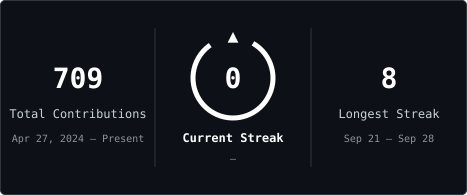

 

  

## 👨‍💻 About me

<table>
  <tr>
    <td width="62%" valign="middle" align="left">
      Hi there! I'm <b>Nick</b>, a developer. Right now I'm building <b>Astranet</b> — a social platform with communities, chats, a feed and voice rooms: a Go backend, a Flutter client for iOS, Android and web, and a React web client. I also build websites with Astro and set up the infrastructure myself: GitLab, CI/CD, Docker.
        
      <b>🚀 <a href="https://github.com/AstranetApp">Astranet</a> — Go · Flutter · React</b> 
      <b>🦷 <a href="https://github.com/NikitaDm1trievich/dentalcruise">Clinic website</a> on Astro</b> 
      <b>🦊 Deploying self-hosted GitLab, runners and CI/CD</b> 
      <b>🏗️ 1C: architecture solutions from scratch, turnkey</b> 
      <b>📍 Moscow</b>
    </td>
    <td width="38%" align="center" valign="middle">
      
    </td>
  </tr>
</table>

## ⚙️ Technologies

  
  
  
  
  
  

  
  
  
  

  
  
  
  
  

## 📈 Statistics

<table>
  <tr>
    <td></td>
    <td></td>
  </tr>
</table>

Statistics reflect public GitHub activity only, not the full scope of commercial experience.

---

<i>Reliability starts with understanding the data and the consequences of every change.</i>

