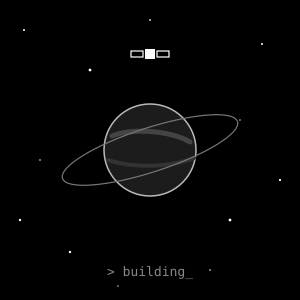
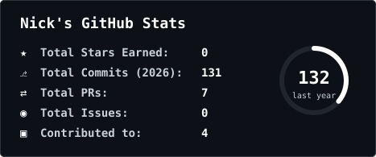
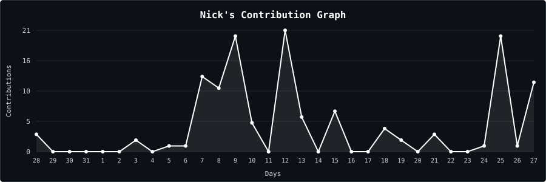

 

  

## 👨‍💻 Обо мне

<table>
  <tr>
    <td width="62%" valign="middle" align="left">
      Привет! Я <b>Nick</b> — разработчик. Сейчас строю <b>Astranet</b> — соцплатформу с сообществами, чатами, лентой и голосовыми комнатами: Go-бэкенд, Flutter-клиент под iOS, Android и web и React-веб-клиент. Параллельно делаю сайты на Astro и сам поднимаю инфраструктуру: GitLab, CI/CD, Docker.
        
      <b>🚀 <a href="https://github.com/AstranetApp">Astranet</a> — Go · Flutter · React</b> 
      <b>🦷 <a href="https://github.com/NikitaDm1trievich/dentalcruise">Сайт клиники</a> на Astro</b> 
      <b>🦊 Разворачиваю self-hosted GitLab, раннеры и CI/CD</b> 
      <b>🏗️ 1С: архитектурные решения с нуля под ключ</b> 
      <b>📍 Москва</b>
    </td>
    <td width="38%" align="center" valign="middle">
      
    </td>
  </tr>
</table>

## ⚙️ Технологии

  
  
  
  
  
  

  
  
  
  

  
  
  
  
  

## 📈 Статистика

<table>
  <tr>
    <td></td>
    <td></td>
  </tr>
</table>

Статистика отражает только публичную активность GitHub и не характеризует весь коммерческий опыт.

---

<i>Надёжность начинается с понимания данных и последствий каждого изменения.</i>

